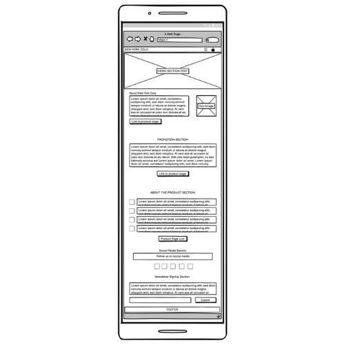
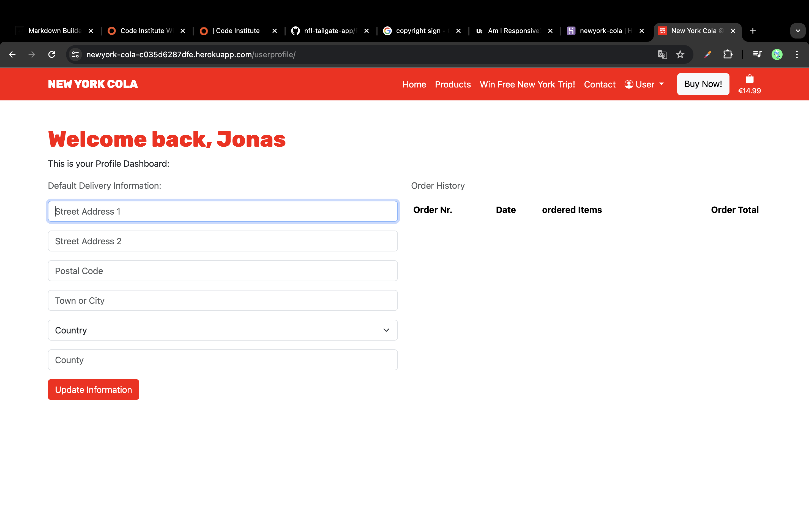

# Welcome to the Documentation of the [NEWYORK COLA ©](https://newyork-cola-c035d6287dfe.herokuapp.com) WEBSITE!

## About

New York Cola is the soft drink for New York locals, fans of the city and tourists. In the city that never sleeps, you need caffeine and refreshment. In this online store you can experience the brand, take part in a competition and buy the products. Enjoy it and taste the city.

source: [amiresponsive](https://ui.dev/amiresponsive?url=https://newyork-cola-c035d6287dfe.herokuapp.com)

## UX

### Colour Scheme

- `#ff0000` used for section backgrounds, buttons and headings texts.
- `#ffffff` used for section backgrounds and text on `#ff0000` backgrounds.
- `#212529` used for text color on `#ffffff` backgrounds.

### Typography

- I used 'Rubik'-Font from [GoogleFonts](https://fonts.google.com/) for headings and the brands logo.
- I used the 'Bootstrap Native Font Stack' for optimum text rendering on every device and OS. [Read more here!](https://getbootstrap.com/docs/5.3/content/reboot/#native-font-stack)
- [Bootstrap Icons](https://icons.getbootstrap.com/) icons were used throughout the site, such as the social media icons in the footer.

## User Stories

### New Site Users / General Site User

- As a (new) site user, I would like to have access to general information about new york cola, so that I can get to know all important information about the product.
- As a (new) site user, I can easily find where to purchase The New York Cola products so that I can easily purchase the product without searching for a long time.
- As a (new) site user, I can view all information about the product on the product page, as well as selecting the packages I want to order, and add them to the shopping card so that I can purchase it later.
- As a (new) site user, I can add New York Cola to my shopping cart so that I can purchase it later.
- As a (new) site user, I can view my shopping cart so that I can review my selected items before checkout.
- As a (new) site user, I can proceed to checkout so that I can complete my purchase.
- As a (new) site user, I can create an account so that I can save my information for future purchases.
- As a (new) site user, I can remove items from my shopping cart so that I can eliminate unwanted products.
- As a (new) site user, I can update the quantity of items in my shopping cart so that I can adjust my order as needed.
- As a (new) site user, who just created an account, I want to receive an email after the sign up process so that I can confirm my account.
- As a (new) site user, I want to receive a confirmation email after completing a purchase so that I have a record of my order.
- As a (new) site user, I can signup to a newsletter in order to receive messages on promos and more.

### Returning / Registered Site Users

- As a registered site user, I can log in to my account so that I can access my saved information.
- As a registered site user, I can view and update my account information so that I can update my information in case I have a new address, etc.
- As a registered site user, I can view my latest purchases so that I can keep track of what I've purchased.
- As a returning site user, I can contact the company so that I can ask questions on my orders, get help, etc.

## Wireframes

To follow best practice, wireframes were developed for mobile, tablet, and desktop sizes.
I've used [Balsamiq](https://balsamiq.com/wireframes) to design my site wireframes.

### Mobile Wireframes

| Home | Contact | Contest | All Colas | Product Page | Bag | Checkout | Profile |
| --- | --- | --- | --- | --- | --- | --- | --- |
|  |  |  |  |  |  |  |  |

### Tablet Wireframes

| Home | Contact | Contest | All Colas | Product Page | Bag | Checkout | Profile |
| --- | --- | --- | --- | --- | --- | --- | --- |
|  |  |  |  |  |  |  |  |

### Desktop Wireframes

| Home | Contact | Contest | All Colas | Product Page | Bag | Checkout | Profile |
| --- | --- | --- | --- | --- | --- | --- | --- |
|  |  |  |  |  |  |  |  |

## Features

### Existing Features

| Feature-Name | Feature-Image | Feature-Description |
| --- | --- | --- |
| Feature #1: The Navbar |  | The navbar is there to make it easy for the user to navigate through the site and access it at any time. |
| Feature #2: The Homepage |  | The homepage is there to provide the user with general information about the brand, for example about the competition, the product, etc. |
| Feature #3: Buttons |  | The buttons on all pages increase the ease of user navigation and are coordinated with the respective section CTAs. |
| Feature #4: Product-Section |  | The product section on the homepage is there to give the user general information about the product with a call to action button that acts as a link to the products page. |
| Feature #5: The Newsletter Form |  | With the newsletter form, customers can subscribe to the newsletter and never miss out on offers, information and other things again. |
| Feature #6: The Socials Section |  | In the socials section, users will find links to the brand's social media channels. The icons serve as visually appealing links. |
| Feature #7: All Products Page |  | On the all-products page, users can find all the brand's products and go to the relevant product page. |
| Feature #8: The Contest-Page |  | Users can register for the contest via a form on the contest page. |
| Feature #9: The Contact-Page |  | Via the contact page, users can simply submit their questions to the brand using the form placed there and thus receive simple support. |
| Feature #10: Userprofile |  | If the user decides to create a user profile, he can easily edit his order details there, which he can use for future orders and view his order history. |
| Feature #11: The Shopping Bag |  | On the Shopping Bag page, the user can view his current total at any time, which products he has selected and adjust the products, etc. When the bag is empty, the user will see a button that acts as a link and takes the user back to the all products page. |

### Future Features
