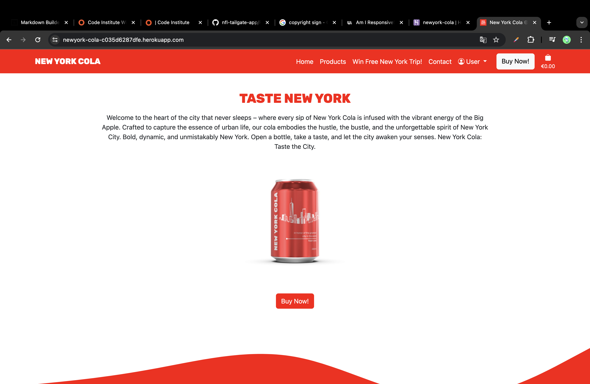
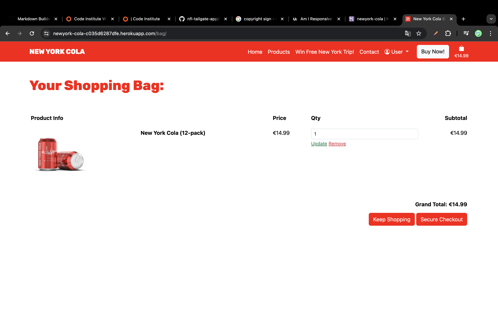
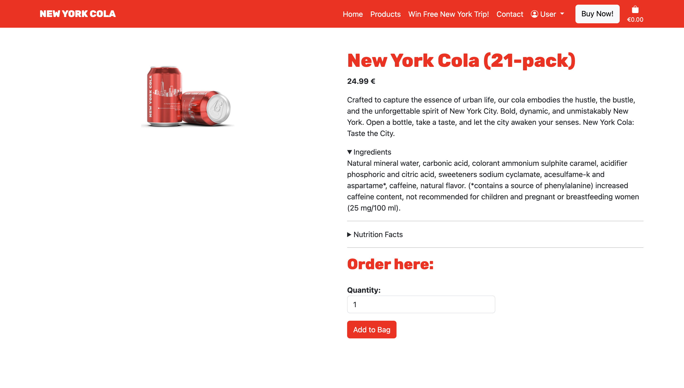

# Welcome to the Documentation of the [NEW YORK COLA ©](https://newyork-cola-c035d6287dfe.herokuapp.com) Website!

[](https://github.com/firstnamejonas/newyork-cola/commits/main)
[](https://github.com/firstnamejonas/newyork-cola/commits/main)
[](https://github.com/firstnamejonas/newyork-cola)

## About

New York Cola is the soft drink for New York locals, fans of the city and tourists. In the city that never sleeps, you need caffeine and refreshment. In this online store you can experience the brand, take part in a competition and buy the products. Enjoy it and taste the city.
Take a look at the finished project [here](https://newyork-cola-c035d6287dfe.herokuapp.com/)!


source: [amiresponsive](https://ui.dev/amiresponsive?url=https://newyork-cola-c035d6287dfe.herokuapp.com)

## UX

### Colour Scheme

- `#ff0000` used for section backgrounds, buttons and headings texts.
- `#ffffff` used for section backgrounds and text on `#ff0000` backgrounds.
- `#212529` used for text color on `#ffffff` backgrounds.

### Typography

- I used 'Rubik'-Font from [GoogleFonts](https://fonts.google.com/) for headings and the brands logo.
- I used the 'Bootstrap Native Font Stack' for optimum text rendering on every device and OS. [Read more here!](https://getbootstrap.com/docs/5.3/content/reboot/#native-font-stack)
- [Bootstrap Icons](https://icons.getbootstrap.com/) icons were used throughout the site, such as the social media icons in the footer.

## User Stories

### New Site Users / General Site User

- As a (new) site user, I would like to have access to general information about new york cola, so that I can get to know all important information about the product.
- As a (new) site user, I can easily find where to purchase The New York Cola products so that I can easily purchase the product without searching for a long time.
- As a (new) site user, I can view all information about the product on the product page, as well as selecting the packages I want to order, and add them to the shopping card so that I can purchase it later.
- As a (new) site user, I can add New York Cola to my shopping cart so that I can purchase it later.
- As a (new) site user, I can view my shopping cart so that I can review my selected items before checkout.
- As a (new) site user, I can proceed to checkout so that I can complete my purchase.
- As a (new) site user, I can create an account so that I can save my information for future purchases.
- As a (new) site user, I can remove items from my shopping cart so that I can eliminate unwanted products.
- As a (new) site user, I can update the quantity of items in my shopping cart so that I can adjust my order as needed.
- As a (new) site user, who just created an account, I want to receive an email after the sign up process so that I can confirm my account.
- As a (new) site user, I want to receive a confirmation email after completing a purchase so that I have a record of my order.
- As a (new) site user, I can signup to a newsletter in order to receive messages on promos and more.

### Returning / Registered Site Users

- As a registered site user, I can log in to my account so that I can access my saved information.
- As a registered site user, I can view and update my account information so that I can update my information in case I have a new address, etc.
- As a registered site user, I can view my latest purchases so that I can keep track of what I've purchased.
- As a returning site user, I can contact the company so that I can ask questions on my orders, get help, etc.

### Admin
- As an admin of the site, I can add, update and delete products so that I can manage the stores products easily on the frontend.

## Wireframes

To follow best practice, wireframes were developed for mobile, tablet, and desktop sizes.
I've used [Balsamiq](https://balsamiq.com/wireframes) to design my site wireframes.

### Mobile Wireframes

| Home | Contact | Contest | All Colas | Product Page | Bag | Checkout | Profile |
| --- | --- | --- | --- | --- | --- | --- | --- |
|  |  |  |  |  |  |  |  |

### Tablet Wireframes

| Home | Contact | Contest | All Colas | Product Page | Bag | Checkout | Profile |
| --- | --- | --- | --- | --- | --- | --- | --- |
|  |  |  |  |  |  |  |  |

### Desktop Wireframes

| Home | Contact | Contest | All Colas | Product Page | Bag | Checkout | Profile |
| --- | --- | --- | --- | --- | --- | --- | --- |
|  |  |  |  |  |  |  |  |

## Features

### Existing Features

| Feature-Name | Feature-Image | Feature-Description |
| --- | --- | --- |
| Feature #1: The Navbar |  | The navbar is there to make it easy for the user to navigate through the site and access it at any time. |
| Feature #2: The Homepage |  | The homepage is there to provide the user with general information about the brand, for example about the competition, the product, etc. |
| Feature #3: Buttons |  | The buttons on all pages increase the ease of user navigation and are coordinated with the respective section CTAs. |
| Feature #4: Product-Section |  | The product section on the homepage is there to give the user general information about the product with a call to action button that acts as a link to the products page. |
| Feature #5: The Newsletter Form |  | With the newsletter form, customers can subscribe to the newsletter and never miss out on offers, information and other things again. |
| Feature #6: The Socials Section |  | In the socials section, users will find links to the brand's social media channels. The icons serve as visually appealing links. |
| Feature #7: All Products Page |  | On the all-products page, users can find all the brand's products and go to the relevant product page. |
| Feature #8: The Contest-Page |  | Users can register for the contest via a form on the contest page. |
| Feature #9: The Contact-Page |  | Via the contact page, users can simply submit their questions to the brand using the form placed there and thus receive simple support. |
| Feature #10: Userprofile |  | If the user decides to create a user profile, he can easily edit his order details there, which he can use for future orders and view his order history. |
| Feature #11: The Shopping Bag |  | On the Shopping Bag page, the user can view his current total at any time, which products he has selected and adjust the products, etc. When the bag is empty, the user will see a button that acts as a link and takes the user back to the all products page. |
| Feature #12: Product Page |  | On the product page, users can find all more information about the product and can add them to the shopping card. |

### Future Features

| Future Feature Name | Description |
| --- | --- |
| Future Feature #1: Map | Implement a map on which you can see in which stores and where New York Cola is available. |
| Future Feature #2: Blog | Implement a blog about brand-related topics such as new york, travel to new york and more on the website so that there is good content for SEO. |

## Tools & Technologies Used

- [](https://tim.2bn.dev/markdown-builder) used to generate README and TESTING templates.
- [](https://git-scm.com) used for version control. (`git add`, `git commit`, `git push`)
- [](https://github.com) used for secure online code storage.
- [](https://gitpod.io) used as a cloud-based IDE for development.
- [](https://en.wikipedia.org/wiki/HTML) used for the main site content.
- [](https://en.wikipedia.org/wiki/CSS) used for the main site design and layout.
- [](https://www.javascript.com) used for user interaction on the site.
- [](https://jquery.com) used for user interaction on the site.
- [](https://www.python.org) used as the back-end programming language.
- [](https://www.heroku.com) used for hosting the deployed back-end site.
- [](https://getbootstrap.com) used as the front-end CSS framework for modern responsiveness and pre-built components.
- [](https://www.djangoproject.com) used as the Python framework for the site (incl. Django Allauth, Django Countries, Crispy Forms, etc.).
- [](https://dbs.ci-dbs.net) used as the Postgres database from Code Institute.
- [](https://cloudinary.com) used for online static file storage.
- [](https://whitenoise.readthedocs.io) used for serving static files with Heroku.
- [](https://stripe.com) used for online secure payments of ecommerce products/services.
- [](https://mail.google.com) used for sending emails in my application.
- [](https://balsamiq.com/wireframes) used for creating wireframes.
- [](https://www.canva.com/p/canvawireframes) used for creating product mockups and brand design.
- [](https://chat.openai.com) used to help debug, troubleshoot, and explain things.

## Database Design

I have used `pygraphviz` and `django-extensions` to auto-generate an ERD.

The steps taken were as follows:
- In the terminal: `sudo apt update`
- then: `sudo apt-get install python3-dev graphviz libgraphviz-dev pkg-config`
- then type `Y` to proceed
- then: `pip3 install django-extensions pygraphviz`
- in my `settings.py` file, I added the following to my `INSTALLED_APPS`:
```python
INSTALLED_APPS = [
    ...
    'django_extensions',
    ...
]
```
- back in the terminal: `python3 manage.py graph_models -a -o erd.png`
- dragged the new `erd.png` file into my `documentation/` folder
- removed `'django_extensions',` from my `INSTALLED_APPS`
- finally, in the terminal: `pip3 uninstall django-extensions pygraphviz -y`


source: [medium.com](https://medium.com/@yathomasi1/1-using-django-extensions-to-visualize-the-database-diagram-in-django-application-c5fa7e710e16)

## Agile Development Process

### GitHub Projects

[GitHub Projects](https://github.com/firstnamejonas/newyork-cola/projects) served as an Agile tool for this project.
It isn't a specialized tool, but with the right tags and project creation/issue assignments, it can be made to work.

Through it, user stories, issues, and milestone tasks were planned, then tracked on a weekly basis using the basic Kanban board.


### GitHub Issues

[GitHub Issues](https://github.com/firstnamejonas/newyork-cola/issues) served as an another Agile tool.
There, I used my own **User Story Template** to manage user stories.

It also helped with milestone iterations on a weekly basis.

- [Open Issues](https://github.com/firstnamejonas/newyork-cola/issues) [](https://github.com/firstnamejonas/newyork-cola/issues)

- [Closed Issues](https://github.com/firstnamejonas/newyork-cola/issues?q=is%3Aissue+is%3Aclosed) [](https://github.com/firstnamejonas/newyork-cola/issues?q=is%3Aissue+is%3Aclosed)

### MoSCoW Prioritization

I've decomposed my Epics into stories prior to prioritizing and implementing them.
Using this approach, I was able to apply the MoSCow prioritization and labels to my user stories within the Issues tab.

- **Must Have**: guaranteed to be delivered (*max 60% of stories*)
- **Should Have**: adds significant value, but not vital (*the rest ~20% of stories*)
- **Could Have**: has small impact if left out (*20% of stories*)
- **Won't Have**: not a priority for this iteration

## Ecommerce Business Model

This site sells goods to individual customers, and therefore follows a `Business to Customer` model. It is of the simplest **B2C** forms, as it focuses on individual transactions, and doesn't need anything such as monthly/annual subscriptions.

It is still in its early development stages, although it already has a newsletter, and links for social media marketing.

Social media can potentially build a community of users around the business, and boost site visitor numbers, especially when using larger platforms such as Facebook, Instagram or TikTok.

A newsletter list can be used by the business to send regular messages to site users. For example, what items are on special offer, new items in stock, updates to business hours, notifications of events, and much more!

## Search Engine Optimization (SEO) & Social Media Marketing

### Keywords

I've identified some appropriate keywords to align with my site, that should help users
when searching online to find my page easily from a search engine.
This included a series of the following keyword types

| Keyword Length | Topic: New York Souvenirs | Topic: New York Gifts | Topic: New York | Topic: Cola |
| --- | --- | --- | --- | --- |
| Short-Tail Keywords | - | - | - | - |
|  | New York Souvenir | New York Gifts | New York | Cola |
|  | NYC Souvenir | NYC Presents | NYC | Coca Cola |
|  | NYC Memories | Gift Shop New York | New York Life | Softdrink |
|  | New York Sights | NYC Gifts | NYC Locals | Caffeine Drink |
| Long-Tail Keywords | - | - | - | - |
|  | Unique New York City Souvenirs | High-Quality New York City Gifts | Explore New York City Attractions | Classic Cola Flavors |
|  | Best NYC Souvenirs to Buy | Exclusive NYC Gift Ideas | Discover Hidden Gems of NYC | Top-rated Softdrinks Brands |
|  | New York Souvenir Shops | Unique New York City Souvenirs for Him/Her | Best Things to Do in NYC | Zero Sugar Softdrinks |
|  | Best New York Souvenir | New York themed gifts | Sights in NYC | Top Cola Brands in the world |
|  | Trendy New York City Souvenirs | Gifts from New York | Local Businesses New York City | Zero Sugar Cola |

I also played around with [Word Tracker](https://www.wordtracker.com) a bit to check the frequency of some of my site's primary keywords (only until the free trial expired).

### Sitemap

I've used [XML-Sitemaps](https://www.xml-sitemaps.com) to generate a sitemap.xml file.
This was generated using my deployed site URL: https://newyork-cola-c035d6287dfe.herokuapp.com

After it finished crawling the entire site, it created a
[sitemap.xml](sitemap.xml) which I've downloaded and included in the repository.

### Robots

I've created the [robots.txt](robots.txt) file at the root-level.
Inside, I've included the default settings:

```
User-agent: *
Disallow: /accounts/
Disallow: /bag/
Sitemap: https://newyork-cola-c035d6287dfe.herokuapp.com/sitemap.xml
```

Further links for future implementation:
- [Google search console](https://search.google.com/search-console)
- [Creating and submitting a sitemap](https://developers.google.com/search/docs/advanced/sitemaps/build-sitemap)
- [Managing your sitemaps and using sitemaps reports](https://support.google.com/webmasters/answer/7451001)
- [Testing the robots.txt file](https://support.google.com/webmasters/answer/6062598)

### Social Media Marketing

Creating a strong social base (with participation) and linking that to the business site can help drive sales. Using more popular providers with a wider user base, such as Facebook, typically maximizes site views.

I've created a mockup Facebook & Instagram business account using [Canva](https://www.canva.com/).

| Mockup Facebook Business Account | Mockup Instagram Business Account |
| --- | --- |
|  |  |

### Newsletter Marketing

I have incorporate a newsletter sign-up form on my application, to allow users to supply their
email address if they are interested in learning more. 

## Testing

> [!NOTE]
> For all testing, please refer to the [TESTING.md](TESTING.md) file.

## Deployment

The live deployed application can be found deployed on [Heroku](https://newyork-cola-c035d6287dfe.herokuapp.com).

### PostgreSQL Database

This project uses a [Code Institute PostgreSQL Database](https://dbs.ci-dbs.net).

To obtain my own Postgres Database from Code Institute, I followed these steps:

- Signed-in to the CI LMS using my email address.
- An email was sent to me with my new Postgres Database.

> [!CAUTION]  
> - PostgreSQL databases by Code Institute are only available to CI Students.
> - You must acquire your own PostgreSQL database through some other method
> if you plan to clone/fork this repository.
> - Code Institute students are allowed a maximum of 8 databases.
> - Databases are subject to deletion after 18 months.

### Cloudinary API

This project uses the [Cloudinary API](https://cloudinary.com) to store media assets online, due to the fact that Heroku doesn't persist this type of data.

To obtain your own Cloudinary API key, create an account and log in.

- For *Primary interest*, you can choose *Programmable Media for image and video API*.
- Optional: *edit your assigned cloud name to something more memorable*.
- On your Cloudinary Dashboard, you can copy your **API Environment Variable**.
- Be sure to remove the `CLOUDINARY_URL=` as part of the API **value**; this is the **key**.

### Stripe API

This project uses [Stripe](https://stripe.com) to handle the ecommerce payments.

Once you've created a Stripe account and logged-in, follow these series of steps to get your project connected.

- From your Stripe dashboard, click to expand the "Get your test API keys".
- You'll have two keys here:
	- `STRIPE_PUBLIC_KEY` = Publishable Key (starts with **pk**)
	- `STRIPE_SECRET_KEY` = Secret Key (starts with **sk**)

As a backup, in case users prematurely close the purchase-order page during payment, we can include Stripe Webhooks.

- From your Stripe dashboard, click **Developers**, and select **Webhooks**.
- From there, click **Add Endpoint**.
	- `https://newyork-cola-c035d6287dfe.herokuapp.com/checkout/wh/`
- Click **receive all events**.
- Click **Add Endpoint** to complete the process.
- You'll have a new key here:
	- `STRIPE_WH_SECRET` = Signing Secret (Wehbook) Key (starts with **wh**)

### Gmail API

This project uses [Gmail](https://mail.google.com) to handle sending emails to users for account verification and purchase order confirmations.

Once you've created a Gmail (Google) account and logged-in, follow these series of steps to get your project connected.

- Click on the **Account Settings** (cog icon) in the top-right corner of Gmail.
- Click on the **Accounts and Import** tab.
- Within the section called "Change account settings", click on the link for **Other Google Account settings**.
- From this new page, select **Security** on the left.
- Select **2-Step Verification** to turn it on. (verify your password and account)
- Once verified, select **Turn On** for 2FA.
- Navigate back to the **Security** page, and you'll see a new option called **App passwords**.
- This might prompt you once again to confirm your password and account.
- Select **Mail** for the app type.
- Select **Other (Custom name)** for the device type.
	- Any custom name, such as "Django" or newyork-cola
- You'll be provided with a 16-character password (API key).
	- Save this somewhere locally, as you cannot access this key again later!
	- `EMAIL_HOST_PASS` = user's 16-character API key
	- `EMAIL_HOST_USER` = user's own personal Gmail email address

### Heroku Deployment

This project uses [Heroku](https://www.heroku.com), a platform as a service (PaaS) that enables developers to build, run, and operate applications entirely in the cloud.

Deployment steps are as follows, after account setup:

- Select **New** in the top-right corner of your Heroku Dashboard, and select **Create new app** from the dropdown menu.
- Your app name must be unique, and then choose a region closest to you (EU or USA), and finally, select **Create App**.
- From the new app **Settings**, click **Reveal Config Vars**, and set your environment variables.

> [!IMPORTANT]  
> This is a sample only; you would replace the values with your own if cloning/forking my repository.

| Key | Value |
| --- | --- |
| `CLOUDINARY_URL` | user's own value |
| `DATABASE_URL` | user's own value |
| `EMAIL_HOST_PASS` | 1 (*this is temporary, and can be removed for the final deployment*) |
| `EMAIL_HOST_USER` | user's own value |
| `SECRET_KEY` | user's own value |
| `STRIPE_PUBLIC_KEY` | user's own value |
| `STRIPE_SECRET_KEY` | user's own value |

Heroku needs three additional files in order to deploy properly.

- requirements.txt
- Procfile
- runtime.txt

You can install this project's **requirements** (where applicable) using:

- `pip3 install -r requirements.txt`

If you have your own packages that have been installed, then the requirements file needs updated using:

- `pip3 freeze --local > requirements.txt`

The **Procfile** can be created with the following command:

- `echo web: gunicorn app_name.wsgi > Procfile`
- *replace **app_name** with the name of your primary Django app name; the folder where settings.py is located*

The **runtime.txt** file needs to know which Python version you're using:
1. type: `python3 --version` in the terminal.
2. in the **runtime.txt** file, add your Python version:
	- `python-3.9.18`

For Heroku deployment, follow these steps to connect your own GitHub repository to the newly created app:

Either:

- Select **Automatic Deployment** from the Heroku app.

Or:

- In the Terminal/CLI, connect to Heroku using this command: `heroku login -i`
- Set the remote for Heroku: `heroku git:remote -a app_name` (replace *app_name* with your app name)
- After performing the standard Git `add`, `commit`, and `push` to GitHub, you can now type:
	- `git push heroku main`

The project should now be connected and deployed to Heroku!

### Local Deployment

This project can be cloned or forked in order to make a local copy on your own system.

For either method, you will need to install any applicable packages found within the *requirements.txt* file.

- `pip3 install -r requirements.txt`.

You will need to create a new file called `env.py` at the root-level,
and include the same environment variables listed above from the Heroku deployment steps.

> [!IMPORTANT]  
> This is a sample only; you would replace the values with your own if cloning/forking my repository.

Sample `env.py` file:

```python
import os

os.environ.setdefault("CLOUDINARY_URL", "user's own value")
os.environ.setdefault("DATABASE_URL", "user's own value")
os.environ.setdefault("EMAIL_HOST_PASS", "user's own value")
os.environ.setdefault("EMAIL_HOST_USER", "user's own value")
os.environ.setdefault("SECRET_KEY", "user's own value")
os.environ.setdefault("STRIPE_PUBLIC_KEY", "user's own value")
os.environ.setdefault("STRIPE_SECRET_KEY", "user's own value")

# local environment only (do not include these in production/deployment!)
os.environ.setdefault("DEBUG", "True")
```

Once the project is cloned or forked, in order to run it locally, you'll need to follow these steps:

- Start the Django app: `python3 manage.py runserver`
- Stop the app once it's loaded: `CTRL+C` or `⌘+C` (Mac)
- Make any necessary migrations: `python3 manage.py makemigrations`
- Migrate the data to the database: `python3 manage.py migrate`
- Create a superuser: `python3 manage.py createsuperuser`
- Load fixtures (if applicable): `python3 manage.py loaddata file-name.json` (repeat for each file)
- Everything should be ready now, so run the Django app again: `python3 manage.py runserver`

If you'd like to backup your database models, use the following command for each model you'd like to create a fixture for:

- `python3 manage.py dumpdata your-model > your-model.json`
- *repeat this action for each model you wish to backup*

#### Cloning

You can clone the repository by following these steps:

1. Go to the [GitHub repository](https://github.com/firstnamejonas/newyork-cola) 
2. Locate the Code button above the list of files and click it 
3. Select if you prefer to clone using HTTPS, SSH, or GitHub CLI and click the copy button to copy the URL to your clipboard
4. Open Git Bash or Terminal
5. Change the current working directory to the one where you want the cloned directory
6. In your IDE Terminal, type the following command to clone my repository:
	- `git clone https://github.com/firstnamejonas/newyork-cola.git`
7. Press Enter to create your local clone.

Alternatively, if using Gitpod, you can click below to create your own workspace using this repository.

[](https://gitpod.io/#https://github.com/firstnamejonas/newyork-cola)

Please note that in order to directly open the project in Gitpod, you need to have the browser extension installed.
A tutorial on how to do that can be found [here](https://www.gitpod.io/docs/configure/user-settings/browser-extension).

#### Forking

By forking the GitHub Repository, we make a copy of the original repository on our GitHub account to view and/or make changes without affecting the original owner's repository.
You can fork this repository by using the following steps:

1. Log in to GitHub and locate the [GitHub Repository](https://github.com/firstnamejonas/newyork-cola)
2. At the top of the Repository (not top of page) just above the "Settings" Button on the menu, locate the "Fork" Button.
3. Once clicked, you should now have a copy of the original repository in your own GitHub account!

### Local VS Deployment

There were no differences found.

## Credits

### Content

| Source | Location | Notes |
| --- | --- | --- |
| [Markdown Builder](https://tim.2bn.dev/markdown-builder) | README and TESTING | tool to help generate the Markdown files |
| [WhiteNoise](http://whitenoise.evans.io) | entire site | hosting static files on Heroku temporarily |
| [GetWaves](https://getwaves.io/) | entire site | tool to display wavy transition between sections |
| [CodeInstitute](https://codeinstitute.net/) | entire site | support to implement different functionality |

### Media

| Source | Location | Type | Notes |
| --- | --- | --- | --- |
| [Canva](https://www.canva.com/) | entire site | image | New York Image |
| [Smartmockups](https://smartmockups.com/) | entire site | image | product pictures |

### Acknowledgements
- I would like to thank my family & my partner Caro, for believing in me, and allowing me to make this transition into software development.
- I would like to thank my Code Institute mentor, [Tim Nelson](https://github.com/TravelTimN) for his support throughout the development of this project. He's the best mentor and actively helped me to believe in my skills and get through all the projects. Thank you Tim!
- I would like to thank my 'exchange' Code Institute mentor Chris for quickly helping out and supporting me in the last stages of finishing up the project!
- I would like to thank the [Code Institute Slack community](https://code-institute-room.slack.com) for the moral support; it kept me going during periods of self doubt and imposter syndrome.