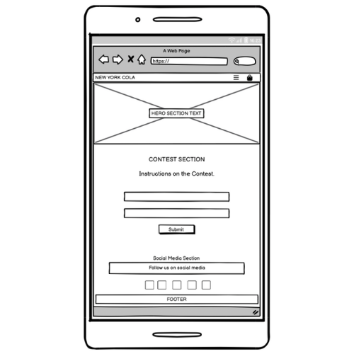
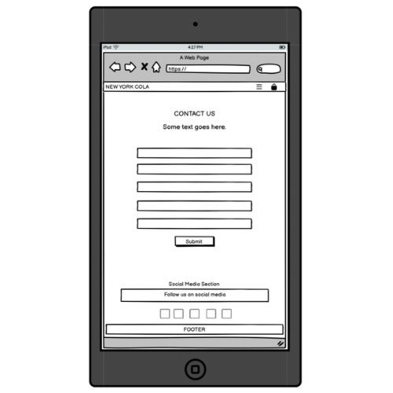

# Welcome to the Documentation of the [NEWYORK COLA ©](https://newyork-cola-c035d6287dfe.herokuapp.com) WEBSITE!

[](https://github.com/firstnamejonas/newyork-cola/commits/main)
[](https://github.com/firstnamejonas/newyork-cola/commits/main)
[](https://github.com/firstnamejonas/newyork-cola)

## About

New York Cola is the soft drink for New York locals, fans of the city and tourists. In the city that never sleeps, you need caffeine and refreshment. In this online store you can experience the brand, take part in a competition and buy the products. Enjoy it and taste the city.


source: [amiresponsive](https://ui.dev/amiresponsive?url=https://newyork-cola-c035d6287dfe.herokuapp.com)

## UX

### Colour Scheme

- `#ff0000` used for section backgrounds, buttons and headings texts.
- `#ffffff` used for section backgrounds and text on `#ff0000` backgrounds.
- `#212529` used for text color on `#ffffff` backgrounds.

### Typography

- I used 'Rubik'-Font from [GoogleFonts](https://fonts.google.com/) for headings and the brands logo.
- I used the 'Bootstrap Native Font Stack' for optimum text rendering on every device and OS. [Read more here!](https://getbootstrap.com/docs/5.3/content/reboot/#native-font-stack)
- [Bootstrap Icons](https://icons.getbootstrap.com/) icons were used throughout the site, such as the social media icons in the footer.

## User Stories

### New Site Users / General Site User

- As a (new) site user, I would like to have access to general information about new york cola, so that I can get to know all important information about the product.
- As a (new) site user, I can easily find where to purchase The New York Cola products so that I can easily purchase the product without searching for a long time.
- As a (new) site user, I can view all information about the product on the product page, as well as selecting the packages I want to order, and add them to the shopping card so that I can purchase it later.
- As a (new) site user, I can add New York Cola to my shopping cart so that I can purchase it later.
- As a (new) site user, I can view my shopping cart so that I can review my selected items before checkout.
- As a (new) site user, I can proceed to checkout so that I can complete my purchase.
- As a (new) site user, I can create an account so that I can save my information for future purchases.
- As a (new) site user, I can remove items from my shopping cart so that I can eliminate unwanted products.
- As a (new) site user, I can update the quantity of items in my shopping cart so that I can adjust my order as needed.
- As a (new) site user, who just created an account, I want to receive an email after the sign up process so that I can confirm my account.
- As a (new) site user, I want to receive a confirmation email after completing a purchase so that I have a record of my order.
- As a (new) site user, I can signup to a newsletter in order to receive messages on promos and more.

### Returning / Registered Site Users

- As a registered site user, I can log in to my account so that I can access my saved information.
- As a registered site user, I can view and update my account information so that I can update my information in case I have a new address, etc.
- As a registered site user, I can view my latest purchases so that I can keep track of what I've purchased.
- As a returning site user, I can contact the company so that I can ask questions on my orders, get help, etc.

## Wireframes

To follow best practice, wireframes were developed for mobile, tablet, and desktop sizes.
I've used [Balsamiq](https://balsamiq.com/wireframes) to design my site wireframes.

### Mobile Wireframes

| Home | Contact | Contest | All Colas | Product Page | Bag | Checkout | Profile |
| --- | --- | --- | --- | --- | --- | --- | --- |
|  |  |  |  |  |  |  |  |

### Tablet Wireframes

| Home | Contact | Contest | All Colas | Product Page | Bag | Checkout | Profile |
| --- | --- | --- | --- | --- | --- | --- | --- |
|  |  |  |  |  |  |  |  |

### Desktop Wireframes

| Home | Contact | Contest | All Colas | Product Page | Bag | Checkout | Profile |
| --- | --- | --- | --- | --- | --- | --- | --- |
|  |  |  |  |  |  |  |  |

## Features

### Existing Features

| Feature-Name | Feature-Image | Feature-Description |
| --- | --- | --- |
| Feature #1: The Navbar |  | The navbar is there to make it easy for the user to navigate through the site and access it at any time. |
| Feature #2: The Homepage |  | The homepage is there to provide the user with general information about the brand, for example about the competition, the product, etc. |
| Feature #3: Buttons |  | The buttons on all pages increase the ease of user navigation and are coordinated with the respective section CTAs. |
| Feature #4: Product-Section |  | The product section on the homepage is there to give the user general information about the product with a call to action button that acts as a link to the products page. |
| Feature #5: The Newsletter Form |  | With the newsletter form, customers can subscribe to the newsletter and never miss out on offers, information and other things again. |
| Feature #6: The Socials Section |  | In the socials section, users will find links to the brand's social media channels. The icons serve as visually appealing links. |
| Feature #7: All Products Page |  | On the all-products page, users can find all the brand's products and go to the relevant product page. |
| Feature #8: The Contest-Page |  | Users can register for the contest via a form on the contest page. |
| Feature #9: The Contact-Page |  | Via the contact page, users can simply submit their questions to the brand using the form placed there and thus receive simple support. |
| Feature #10: Userprofile |  | If the user decides to create a user profile, he can easily edit his order details there, which he can use for future orders and view his order history. |
| Feature #11: The Shopping Bag |  | On the Shopping Bag page, the user can view his current total at any time, which products he has selected and adjust the products, etc. When the bag is empty, the user will see a button that acts as a link and takes the user back to the all products page. |

### Future Features

| Future Feature Name | Description |
| --- | --- |
| Future Feature #1: Map | Implement a map on which you can see in which stores and where New York Cola is available. |

## Tools & Technologies Used

- [](https://tim.2bn.dev/markdown-builder) used to generate README and TESTING templates.
- [](https://git-scm.com) used for version control. (`git add`, `git commit`, `git push`)
- [](https://github.com) used for secure online code storage.
- [](https://gitpod.io) used as a cloud-based IDE for development.
- [](https://en.wikipedia.org/wiki/HTML) used for the main site content.
- [](https://en.wikipedia.org/wiki/CSS) used for the main site design and layout.
- [](https://www.javascript.com) used for user interaction on the site.
- [](https://jquery.com) used for user interaction on the site.
- [](https://www.python.org) used as the back-end programming language.
- [](https://www.heroku.com) used for hosting the deployed back-end site.
- [](https://getbootstrap.com) used as the front-end CSS framework for modern responsiveness and pre-built components.
- [](https://www.djangoproject.com) used as the Python framework for the site (incl. Django Allauth, Django Countries, Crispy Forms, etc.).
- [](https://dbs.ci-dbs.net) used as the Postgres database from Code Institute.
- [](https://cloudinary.com) used for online static file storage.
- [](https://whitenoise.readthedocs.io) used for serving static files with Heroku.
- [](https://stripe.com) used for online secure payments of ecommerce products/services.
- [](https://mail.google.com) used for sending emails in my application.
- [](https://balsamiq.com/wireframes) used for creating wireframes.
- [](https://www.canva.com/p/canvawireframes) used for creating product mockups and brand design.
- [](https://chat.openai.com) used to help debug, troubleshoot, and explain things.

## Database Design

I have used `pygraphviz` and `django-extensions` to auto-generate an ERD.

The steps taken were as follows:
- In the terminal: `sudo apt update`
- then: `sudo apt-get install python3-dev graphviz libgraphviz-dev pkg-config`
- then type `Y` to proceed
- then: `pip3 install django-extensions pygraphviz`
- in my `settings.py` file, I added the following to my `INSTALLED_APPS`:
```python
INSTALLED_APPS = [
    ...
    'django_extensions',
    ...
]
```
- back in the terminal: `python3 manage.py graph_models -a -o erd.png`
- dragged the new `erd.png` file into my `documentation/` folder
- removed `'django_extensions',` from my `INSTALLED_APPS`
- finally, in the terminal: `pip3 uninstall django-extensions pygraphviz -y`


source: [medium.com](https://medium.com/@yathomasi1/1-using-django-extensions-to-visualize-the-database-diagram-in-django-application-c5fa7e710e16)

## Agile Development Process

### GitHub Projects

[GitHub Projects](https://github.com/firstnamejonas/newyork-cola/projects) served as an Agile tool for this project.
It isn't a specialized tool, but with the right tags and project creation/issue assignments, it can be made to work.

Through it, user stories, issues, and milestone tasks were planned, then tracked on a weekly basis using the basic Kanban board.


### GitHub Issues

[GitHub Issues](https://github.com/firstnamejonas/newyork-cola/issues) served as an another Agile tool.
There, I used my own **User Story Template** to manage user stories.

It also helped with milestone iterations on a weekly basis.

- [Open Issues](https://github.com/firstnamejonas/newyork-cola/issues) [](https://github.com/firstnamejonas/newyork-cola/issues)

- [Closed Issues](https://github.com/firstnamejonas/newyork-cola/issues?q=is%3Aissue+is%3Aclosed) [](https://github.com/firstnamejonas/newyork-cola/issues?q=is%3Aissue+is%3Aclosed)

### MoSCoW Prioritization

I've decomposed my Epics into stories prior to prioritizing and implementing them.
Using this approach, I was able to apply the MoSCow prioritization and labels to my user stories within the Issues tab.

- **Must Have**: guaranteed to be delivered (*max 60% of stories*)
- **Should Have**: adds significant value, but not vital (*the rest ~20% of stories*)
- **Could Have**: has small impact if left out (*20% of stories*)
- **Won't Have**: not a priority for this iteration

## Ecommerce Business Model

This site sells goods to individual customers, and therefore follows a `Business to Customer` model. It is of the simplest **B2C** forms, as it focuses on individual transactions, and doesn't need anything such as monthly/annual subscriptions.

It is still in its early development stages, although it already has a newsletter, and links for social media marketing.

Social media can potentially build a community of users around the business, and boost site visitor numbers, especially when using larger platforms such as Facebook, Instagram or TikTok.

A newsletter list can be used by the business to send regular messages to site users. For example, what items are on special offer, new items in stock, updates to business hours, notifications of events, and much more!

## Search Engine Optimization (SEO) & Social Media Marketing

### Keywords

I've identified some appropriate keywords to align with my site, that should help users
when searching online to find my page easily from a search engine.
This included a series of the following keyword types

| Keyword Length | Topic: New York Souvenirs | Topic: New York Gifts | Topic: New York | Topic: Cola |
| --- | --- | --- | --- | --- |
| Short-Tail Keywords | - | - | - | - |
|  | New York Souvenir | New York Gifts | New York | Cola |
|  | NYC Souvenir | NYC Presents | NYC | Coca Cola |
|  | NYC Memories | Gift Shop New York | New York Life | Softdrink |
|  | New York Sights | NYC Gifts | NYC Locals | Caffeine Drink |
| Long-Tail Keywords | - | - | - | - |
|  | Unique New York City Souvenirs | High-Quality New York City Gifts | Explore New York City Attractions | Classic Cola Flavors |
|  | Best NYC Souvenirs to Buy | Exclusive NYC Gift Ideas | Discover Hidden Gems of NYC | Top-rated Softdrinks Brands |
|  | New York Souvenir Shops | Unique New York City Souvenirs for Him/Her | Best Things to Do in NYC | Zero Sugar Softdrinks |
|  | Best New York Souvenir | New York themed gifts | Sights in NYC | Top Cola Brands in the world |
|  | Trendy New York City Souvenirs | Gifts from New York | Local Businesses New York City | Zero Sugar Cola |

I also played around with [Word Tracker](https://www.wordtracker.com) a bit to check the frequency of some of my site's primary keywords (only until the free trial expired).

