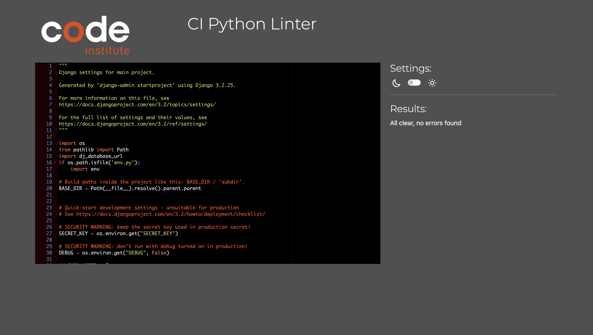

# Testing

> [!NOTE]  
> Return back to the [README.md](README.md) file.

## Code Validation

### HTML

I have used the recommended [HTML W3C Validator](https://validator.w3.org) to validate all of my HTML files.

| Directory | File | Screenshot | Notes | Link |
| --- | --- | --- | --- | --- |
| home | index.html |  | Minor warning that doesn't requires any actions. | [Click here](https://validator.w3.org/nu/?doc=https%3A%2F%2Fnewyork-cola-c035d6287dfe.herokuapp.com%2F) |
| colas | all_colas.html |  | Minor warning that doesn't requires any actions. | [Click here](https://validator.w3.org/nu/?doc=https%3A%2F%2Fnewyork-cola-c035d6287dfe.herokuapp.com%2Fproducts%2F) |
| colas | product_page.html |  | Minor warning that doesn't requires any actions. | [Click here](https://validator.w3.org/nu/?doc=https%3A%2F%2Fnewyork-cola-c035d6287dfe.herokuapp.com%2Fproducts%2F4) |
| contact | contact_page.html |  | The shown error is a known error. I changed the placeholder to 'None' in order to no trigger the bug if I delete the placeholder that triggers the error. | [Click here](https://validator.w3.org/nu/?showsource=yes&doc=https%3A%2F%2Fnewyork-cola-c035d6287dfe.herokuapp.com%2Fcontact%2F) |
| promo | contest_page.html |  | Minor warning that doesn't requires any actions. | [Click here](https://validator.w3.org/nu/?showsource=yes&doc=https%3A%2F%2Fnewyork-cola-c035d6287dfe.herokuapp.com%2Fcontest%2F) |
| bag | bag.html |  | Minor warning that doesn't requires any actions. | [Click here](https://validator.w3.org/nu/?showsource=yes&doc=https%3A%2F%2Fnewyork-cola-c035d6287dfe.herokuapp.com%2Fbag%2F) |
| checkout | checkout.html |  | No errors or warnings to show. | [Click here](https://validator.w3.org/nu/?doc=https%3A%2F%2Fnewyork-cola-c035d6287dfe.herokuapp.com%2Fcheckout%2F) |
| checkout | checkout_success.html |  | No errors or warnings to show. | [Click here](https://validator.w3.org/nu/?doc=https%3A%2F%2Fnewyork-cola-c035d6287dfe.herokuapp.com%2Fcheckout%2Fcheckout_success%2F1063805ACEA34789A360F34488620EAD) |
| userprofiles | userprofile.html |  | Due to a non-document-error the live site of userprofile can't be checked via the HTML validator. I checked it with the text input option on the HTML validator and got no errors or warnings. | [Click here](https://validator.w3.org/nu/?showsource=yes&doc=https%3A%2F%2Fnewyork-cola-c035d6287dfe.herokuapp.com%2Fuserprofile%2F) |
| templates | All Allauth Files |  | Representative for all other allauth templates I tested the signup template, since they‘re all based on the same structure. | [Click here](https://validator.w3.org/nu/?doc=https%3A%2F%2Fnewyork-cola-c035d6287dfe.herokuapp.com%2Faccounts%2Fsignup%2F) |

### CSS

I have used the recommended [CSS Jigsaw Validator](https://jigsaw.w3.org/css-validator) to validate all of my CSS files.

| File | Jigsaw URL | Screenshot | Notes |
| --- | --- | --- | --- |
| style.css | [Jigsaw](https://jigsaw.w3.org/css-validator/validator?uri=https%3A%2F%2Fnewyork-cola-c035d6287dfe.herokuapp.com%2F&profile=css3svg&usermedium=all&warning=1&vextwarning=&lang=de) |  | Pass: No Errors |

### JavaScript

I have used the recommended [JShint Validator](https://jshint.com) to validate all of my JS files.

| File | Screenshot | Notes |
| --- | --- | --- |
| stripe_elements.js |  | Undefined Stripe variable |

### Python

I have used the recommended [PEP8 CI Python Linter](https://pep8ci.herokuapp.com) to validate all of my Python files.

| App | File | CI URL | Screenshot | Notes |
| --- | --- | --- | --- | --- |
| Bag | --- | --- | --- | --- |
| --- | contexts.py | [PEP8 CI](https://pep8ci.herokuapp.com/https://raw.githubusercontent.com/firstnamejonas/newyork-cola/main/bag/contexts.py) |  | No errors or warnings. |
| --- | urls.py | [PEP8 CI](https://pep8ci.herokuapp.com/https://raw.githubusercontent.com/firstnamejonas/newyork-cola/main/bag/urls.py) |  | No errors or warnings. |
| --- | views.py | [PEP8 CI](https://pep8ci.herokuapp.com/https://raw.githubusercontent.com/firstnamejonas/newyork-cola/main/bag/views.py) |  | No errors or warnings. |
| Checkout | --- | --- | --- | --- |
| --- | admin.py | [PEP8 CI](https://pep8ci.herokuapp.com/https://raw.githubusercontent.com/firstnamejonas/newyork-cola/main/checkout/admin.py) |  | No errors or warnings. |
| --- | forms.py | [PEP8 CI](https://pep8ci.herokuapp.com/https://raw.githubusercontent.com/firstnamejonas/newyork-cola/main/checkout/forms.py) |  | No errors or warnings. |
| --- | models.py | [PEP8 CI](https://pep8ci.herokuapp.com/https://raw.githubusercontent.com/firstnamejonas/newyork-cola/main/checkout/models.py) |  | No errors or warnings. |
| --- | signals.py | [PEP8 CI](https://pep8ci.herokuapp.com/https://raw.githubusercontent.com/firstnamejonas/newyork-cola/main/checkout/signals.py) |  | No errors or warnings. |
| --- | urls.py | [PEP8 CI](https://pep8ci.herokuapp.com/https://raw.githubusercontent.com/firstnamejonas/newyork-cola/main/checkout/urls.py) |  | No errors or warnings. |
| --- | views.py | [PEP8 CI](https://pep8ci.herokuapp.com/https://raw.githubusercontent.com/firstnamejonas/newyork-cola/main/checkout/views.py) |  | No errors or warnings. |
| Colas | --- | --- | --- | --- |
| --- | admin.py | [PEP8 CI](https://pep8ci.herokuapp.com/https://raw.githubusercontent.com/firstnamejonas/newyork-cola/main/colas/admin.py) |  | No errors or warnings. |
| --- | models.py | [PEP8 CI](https://pep8ci.herokuapp.com/https://raw.githubusercontent.com/firstnamejonas/newyork-cola/main/colas/models.py) |  | No errors or warnings. |
| --- | urls.py | [PEP8 CI](https://pep8ci.herokuapp.com/https://raw.githubusercontent.com/firstnamejonas/newyork-cola/main/colas/urls.py) |  | No errors or warnings. |
| --- | views.py | [PEP8 CI](https://pep8ci.herokuapp.com/https://raw.githubusercontent.com/firstnamejonas/newyork-cola/main/colas/views.py) |  | No errors or warnings. |
| Contact | --- | --- | --- | --- |
| --- | admin.py | [PEP8 CI](https://pep8ci.herokuapp.com/https://raw.githubusercontent.com/firstnamejonas/newyork-cola/main/contact/admin.py) |  | No errors or warnings. |
| --- | forms.py | [PEP8 CI](https://pep8ci.herokuapp.com/https://raw.githubusercontent.com/firstnamejonas/newyork-cola/main/contact/forms.py) |  | No errors or warnings. |
| --- | models.py | [PEP8 CI](https://pep8ci.herokuapp.com/https://raw.githubusercontent.com/firstnamejonas/newyork-cola/main/contact/models.py) |  | No errors or warnings. |
| --- | urls.py | [PEP8 CI](https://pep8ci.herokuapp.com/https://raw.githubusercontent.com/firstnamejonas/newyork-cola/main/contact/urls.py) |  | No errors or warnings. |
| --- | views.py | [PEP8 CI](https://pep8ci.herokuapp.com/https://raw.githubusercontent.com/firstnamejonas/newyork-cola/main/contact/views.py) |  | No errors or warnings. |
| Home | --- | --- | --- | --- |
| --- | admin.py | [PEP8 CI](https://pep8ci.herokuapp.com/https://raw.githubusercontent.com/firstnamejonas/newyork-cola/main/home/admin.py) |  | No errors or warnings. |
| --- | forms.py | [PEP8 CI](https://pep8ci.herokuapp.com/https://raw.githubusercontent.com/firstnamejonas/newyork-cola/main/home/forms.py) |  | No errors or warnings. |
| --- | models.py | [PEP8 CI](https://pep8ci.herokuapp.com/https://raw.githubusercontent.com/firstnamejonas/newyork-cola/main/home/models.py) |  | No errors or warnings. |
| --- | urls.py | [PEP8 CI](https://pep8ci.herokuapp.com/https://raw.githubusercontent.com/firstnamejonas/newyork-cola/main/home/urls.py) |  | No errors or warnings. |
| --- | views.py | [PEP8 CI](https://pep8ci.herokuapp.com/https://raw.githubusercontent.com/firstnamejonas/newyork-cola/main/home/views.py) |  | No errors or warnings. |
| Promo | --- | --- | --- | --- |
| --- | admin.py | [PEP8 CI](https://pep8ci.herokuapp.com/https://raw.githubusercontent.com/firstnamejonas/newyork-cola/main/promo/admin.py) |  | No errors or warnings. |
| --- | forms.py | [PEP8 CI](https://pep8ci.herokuapp.com/https://raw.githubusercontent.com/firstnamejonas/newyork-cola/main/promo/forms.py) |  | No errors or warnings. |
| --- | models.py | [PEP8 CI](https://pep8ci.herokuapp.com/https://raw.githubusercontent.com/firstnamejonas/newyork-cola/main/promo/models.py) |  | No errors or warnings. |
| --- | urls.py | [PEP8 CI](https://pep8ci.herokuapp.com/https://raw.githubusercontent.com/firstnamejonas/newyork-cola/main/promo/urls.py) |  | No errors or warnings. |
| --- | views.py | [PEP8 CI](https://pep8ci.herokuapp.com/https://raw.githubusercontent.com/firstnamejonas/newyork-cola/main/promo/views.py) |  | No errors or warnings. |
| Userprofiles | --- | --- | --- | --- |
| --- | admin.py | --- | --- | No code to be validated. |
| --- | forms.py | [PEP8 CI](https://pep8ci.herokuapp.com/https://raw.githubusercontent.com/firstnamejonas/newyork-cola/main/userprofiles/forms.py) |  | No errors or warnings. |
| --- | models.py | [PEP8 CI](https://pep8ci.herokuapp.com/https://raw.githubusercontent.com/firstnamejonas/newyork-cola/main/userprofiles/models.py) |  | No errors or warnings. |
| --- | urls.py | [PEP8 CI](https://pep8ci.herokuapp.com/https://raw.githubusercontent.com/firstnamejonas/newyork-cola/main/userprofiles/urls.py) |  | No errors or warnings. |
| --- | views.py | [PEP8 CI](https://pep8ci.herokuapp.com/https://raw.githubusercontent.com/firstnamejonas/newyork-cola/main/userprofiles/views.py) |  | No errors or warnings. |
| Main | --- | --- | --- | --- |
| --- | settings.py | [PEP8 CI](https://pep8ci.herokuapp.com/https://raw.githubusercontent.com/firstnamejonas/newyork-cola/main/main/settings.py) |  | No errors or warnings. |
| --- | urls.py | [PEP8 CI](https://pep8ci.herokuapp.com/https://raw.githubusercontent.com/firstnamejonas/newyork-cola/main/main/urls.py) |  | No errors or warnings. |