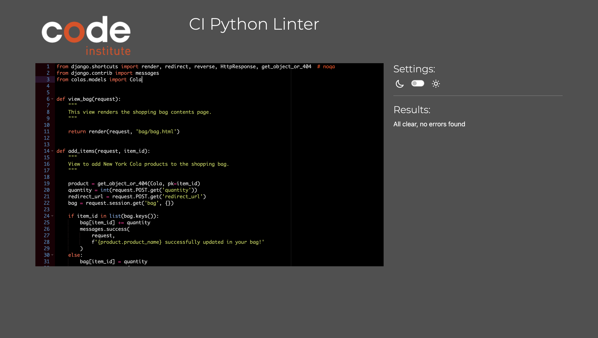
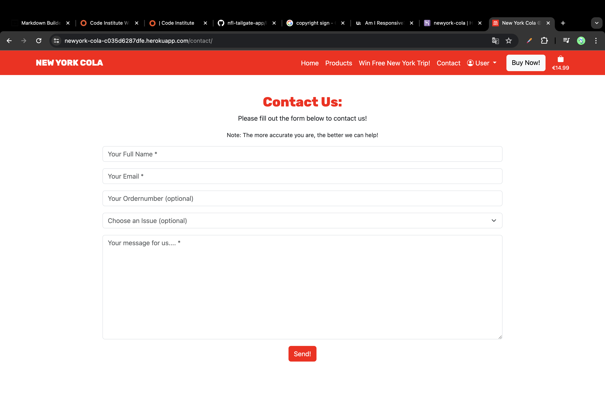

# Testing

> [!NOTE]  
> Return back to the [README.md](README.md) file.

## Code Validation

### HTML

I have used the recommended [HTML W3C Validator](https://validator.w3.org) to validate all of my HTML files.

| Directory | File | Screenshot | Notes | Link |
| --- | --- | --- | --- | --- |
| home | index.html |  | Minor warning that doesn't requires any actions. | [Click here](https://validator.w3.org/nu/?doc=https%3A%2F%2Fnewyork-cola-c035d6287dfe.herokuapp.com%2F) |
| colas | all_colas.html |  | Minor warning that doesn't requires any actions. | [Click here](https://validator.w3.org/nu/?doc=https%3A%2F%2Fnewyork-cola-c035d6287dfe.herokuapp.com%2Fproducts%2F) |
| colas | product_page.html |  | Minor warning that doesn't requires any actions. | [Click here](https://validator.w3.org/nu/?doc=https%3A%2F%2Fnewyork-cola-c035d6287dfe.herokuapp.com%2Fproducts%2F4) |
| contact | contact_page.html |  | The shown error is a known error. I changed the placeholder to 'None' in order to no trigger the bug if I delete the placeholder that triggers the error. | [Click here](https://validator.w3.org/nu/?showsource=yes&doc=https%3A%2F%2Fnewyork-cola-c035d6287dfe.herokuapp.com%2Fcontact%2F) |
| promo | contest_page.html |  | Minor warning that doesn't requires any actions. | [Click here](https://validator.w3.org/nu/?showsource=yes&doc=https%3A%2F%2Fnewyork-cola-c035d6287dfe.herokuapp.com%2Fcontest%2F) |
| bag | bag.html |  | Minor warning that doesn't requires any actions. | [Click here](https://validator.w3.org/nu/?showsource=yes&doc=https%3A%2F%2Fnewyork-cola-c035d6287dfe.herokuapp.com%2Fbag%2F) |
| checkout | checkout.html |  | No errors or warnings to show. | [Click here](https://validator.w3.org/nu/?doc=https%3A%2F%2Fnewyork-cola-c035d6287dfe.herokuapp.com%2Fcheckout%2F) |
| checkout | checkout_success.html |  | No errors or warnings to show. | [Click here](https://validator.w3.org/nu/?doc=https%3A%2F%2Fnewyork-cola-c035d6287dfe.herokuapp.com%2Fcheckout%2Fcheckout_success%2F1063805ACEA34789A360F34488620EAD) |
| userprofiles | userprofile.html |  | Due to a non-document-error the live site of userprofile can't be checked via the HTML validator. I checked it with the text input option on the HTML validator and got no errors or warnings. | [Click here](https://validator.w3.org/nu/?showsource=yes&doc=https%3A%2F%2Fnewyork-cola-c035d6287dfe.herokuapp.com%2Fuserprofile%2F) |
| templates | All Allauth Files |  | Representative for all other allauth templates I tested the signup template, since they‘re all based on the same structure. | [Click here](https://validator.w3.org/nu/?doc=https%3A%2F%2Fnewyork-cola-c035d6287dfe.herokuapp.com%2Faccounts%2Fsignup%2F) |

### CSS

I have used the recommended [CSS Jigsaw Validator](https://jigsaw.w3.org/css-validator) to validate all of my CSS files.

| File | Jigsaw URL | Screenshot | Notes |
| --- | --- | --- | --- |
| style.css | [Jigsaw](https://jigsaw.w3.org/css-validator/validator?uri=https%3A%2F%2Fnewyork-cola-c035d6287dfe.herokuapp.com%2F&profile=css3svg&usermedium=all&warning=1&vextwarning=&lang=de) |  | Pass: No Errors |

### JavaScript

I have used the recommended [JShint Validator](https://jshint.com) to validate all of my JS files.

| File | Screenshot | Notes |
| --- | --- | --- |
| stripe_elements.js |  | Undefined Stripe variable |

### Python

I have used the recommended [PEP8 CI Python Linter](https://pep8ci.herokuapp.com) to validate all of my Python files.

| App | File | CI URL | Screenshot | Notes |
| --- | --- | --- | --- | --- |
| Bag | --- | --- | --- | --- |
| --- | contexts.py | [PEP8 CI](https://pep8ci.herokuapp.com/https://raw.githubusercontent.com/firstnamejonas/newyork-cola/main/bag/contexts.py) |  | No errors or warnings. |
| --- | urls.py | [PEP8 CI](https://pep8ci.herokuapp.com/https://raw.githubusercontent.com/firstnamejonas/newyork-cola/main/bag/urls.py) |  | No errors or warnings. |
| --- | views.py | [PEP8 CI](https://pep8ci.herokuapp.com/https://raw.githubusercontent.com/firstnamejonas/newyork-cola/main/bag/views.py) |  | No errors or warnings. |
| Checkout | --- | --- | --- | --- |
| --- | admin.py | [PEP8 CI](https://pep8ci.herokuapp.com/https://raw.githubusercontent.com/firstnamejonas/newyork-cola/main/checkout/admin.py) |  | No errors or warnings. |
| --- | forms.py | [PEP8 CI](https://pep8ci.herokuapp.com/https://raw.githubusercontent.com/firstnamejonas/newyork-cola/main/checkout/forms.py) |  | No errors or warnings. |
| --- | models.py | [PEP8 CI](https://pep8ci.herokuapp.com/https://raw.githubusercontent.com/firstnamejonas/newyork-cola/main/checkout/models.py) |  | No errors or warnings. |
| --- | signals.py | [PEP8 CI](https://pep8ci.herokuapp.com/https://raw.githubusercontent.com/firstnamejonas/newyork-cola/main/checkout/signals.py) |  | No errors or warnings. |
| --- | urls.py | [PEP8 CI](https://pep8ci.herokuapp.com/https://raw.githubusercontent.com/firstnamejonas/newyork-cola/main/checkout/urls.py) |  | No errors or warnings. |
| --- | views.py | [PEP8 CI](https://pep8ci.herokuapp.com/https://raw.githubusercontent.com/firstnamejonas/newyork-cola/main/checkout/views.py) |  | No errors or warnings. |
| Colas | --- | --- | --- | --- |
| --- | admin.py | [PEP8 CI](https://pep8ci.herokuapp.com/https://raw.githubusercontent.com/firstnamejonas/newyork-cola/main/colas/admin.py) |  | No errors or warnings. |
| --- | models.py | [PEP8 CI](https://pep8ci.herokuapp.com/https://raw.githubusercontent.com/firstnamejonas/newyork-cola/main/colas/models.py) |  | No errors or warnings. |
| --- | urls.py | [PEP8 CI](https://pep8ci.herokuapp.com/https://raw.githubusercontent.com/firstnamejonas/newyork-cola/main/colas/urls.py) |  | No errors or warnings. |
| --- | views.py | [PEP8 CI](https://pep8ci.herokuapp.com/https://raw.githubusercontent.com/firstnamejonas/newyork-cola/main/colas/views.py) |  | No errors or warnings. |
| Contact | --- | --- | --- | --- |
| --- | admin.py | [PEP8 CI](https://pep8ci.herokuapp.com/https://raw.githubusercontent.com/firstnamejonas/newyork-cola/main/contact/admin.py) |  | No errors or warnings. |
| --- | forms.py | [PEP8 CI](https://pep8ci.herokuapp.com/https://raw.githubusercontent.com/firstnamejonas/newyork-cola/main/contact/forms.py) |  | No errors or warnings. |
| --- | models.py | [PEP8 CI](https://pep8ci.herokuapp.com/https://raw.githubusercontent.com/firstnamejonas/newyork-cola/main/contact/models.py) |  | No errors or warnings. |
| --- | urls.py | [PEP8 CI](https://pep8ci.herokuapp.com/https://raw.githubusercontent.com/firstnamejonas/newyork-cola/main/contact/urls.py) |  | No errors or warnings. |
| --- | views.py | [PEP8 CI](https://pep8ci.herokuapp.com/https://raw.githubusercontent.com/firstnamejonas/newyork-cola/main/contact/views.py) |  | No errors or warnings. |
| Home | --- | --- | --- | --- |
| --- | admin.py | [PEP8 CI](https://pep8ci.herokuapp.com/https://raw.githubusercontent.com/firstnamejonas/newyork-cola/main/home/admin.py) |  | No errors or warnings. |
| --- | forms.py | [PEP8 CI](https://pep8ci.herokuapp.com/https://raw.githubusercontent.com/firstnamejonas/newyork-cola/main/home/forms.py) |  | No errors or warnings. |
| --- | models.py | [PEP8 CI](https://pep8ci.herokuapp.com/https://raw.githubusercontent.com/firstnamejonas/newyork-cola/main/home/models.py) |  | No errors or warnings. |
| --- | urls.py | [PEP8 CI](https://pep8ci.herokuapp.com/https://raw.githubusercontent.com/firstnamejonas/newyork-cola/main/home/urls.py) |  | No errors or warnings. |
| --- | views.py | [PEP8 CI](https://pep8ci.herokuapp.com/https://raw.githubusercontent.com/firstnamejonas/newyork-cola/main/home/views.py) |  | No errors or warnings. |
| Promo | --- | --- | --- | --- |
| --- | admin.py | [PEP8 CI](https://pep8ci.herokuapp.com/https://raw.githubusercontent.com/firstnamejonas/newyork-cola/main/promo/admin.py) |  | No errors or warnings. |
| --- | forms.py | [PEP8 CI](https://pep8ci.herokuapp.com/https://raw.githubusercontent.com/firstnamejonas/newyork-cola/main/promo/forms.py) |  | No errors or warnings. |
| --- | models.py | [PEP8 CI](https://pep8ci.herokuapp.com/https://raw.githubusercontent.com/firstnamejonas/newyork-cola/main/promo/models.py) |  | No errors or warnings. |
| --- | urls.py | [PEP8 CI](https://pep8ci.herokuapp.com/https://raw.githubusercontent.com/firstnamejonas/newyork-cola/main/promo/urls.py) |  | No errors or warnings. |
| --- | views.py | [PEP8 CI](https://pep8ci.herokuapp.com/https://raw.githubusercontent.com/firstnamejonas/newyork-cola/main/promo/views.py) |  | No errors or warnings. |
| Userprofiles | --- | --- | --- | --- |
| --- | admin.py | --- | --- | No code to be validated. |
| --- | forms.py | [PEP8 CI](https://pep8ci.herokuapp.com/https://raw.githubusercontent.com/firstnamejonas/newyork-cola/main/userprofiles/forms.py) |  | No errors or warnings. |
| --- | models.py | [PEP8 CI](https://pep8ci.herokuapp.com/https://raw.githubusercontent.com/firstnamejonas/newyork-cola/main/userprofiles/models.py) |  | No errors or warnings. |
| --- | urls.py | [PEP8 CI](https://pep8ci.herokuapp.com/https://raw.githubusercontent.com/firstnamejonas/newyork-cola/main/userprofiles/urls.py) |  | No errors or warnings. |
| --- | views.py | [PEP8 CI](https://pep8ci.herokuapp.com/https://raw.githubusercontent.com/firstnamejonas/newyork-cola/main/userprofiles/views.py) |  | No errors or warnings. |
| Main | --- | --- | --- | --- |
| --- | settings.py | [PEP8 CI](https://pep8ci.herokuapp.com/https://raw.githubusercontent.com/firstnamejonas/newyork-cola/main/main/settings.py) |  | No errors or warnings. |
| --- | urls.py | [PEP8 CI](https://pep8ci.herokuapp.com/https://raw.githubusercontent.com/firstnamejonas/newyork-cola/main/main/urls.py) |  | No errors or warnings. |

## Browser Compatibility

I've tested my deployed project on multiple browsers to check for compatibility issues.

| Browser | Home | Products | Product | Contest | Contact| Signup | Login | Bag | Checkout | Checkout-Success | Profile | Notes |
| --- | --- | --- | --- | --- | --- | --- | --- | --- | --- | --- | --- | --- |
| Chrome |  |  |  |  |  |  |  |  |  |  |  | Works as expected |
| Firefox |  |  |  |  |  |  |  |  |  |  |  | Works as expected |
| Safari |  |  |  |  |  |  |  |  |  |  |  | Works as expected |

## Responsiveness

I've tested my deployed project on multiple devices to check for responsiveness issues.

| Device | Home | Products | Product | Contest | Contact| Signup | Login | Bag | Checkout | Checkout-Success | Profile | Notes |
| --- | --- | --- | --- | --- | --- | --- | --- | --- | --- | --- | --- | --- |
| Mobile (DevTools) |  |  |  |  |  |  |  |  |  |  |  | Works as expected. |
| Tablet (DevTools) |  |  |  |  |  |  |  |  |  |  |  | Works as expected. |
| Desktop |  |  |  |  |  |  |  |  |  |  |  | Works as expected |
| IPhone13 |  |  |  |  |  |  |  |  |  |  |  | Works as expected. |

## Lighthouse Audit

I've tested my deployed project using the Lighthouse Audit tool to check for any major issues.

> [!NOTE]  
> The brand's corporate design results in minimal warnings in the accessibility category in Lighthouse Testing.

| Page | Mobile | Desktop | Notes |
| --- | --- | --- | --- |
| Home |  |  | Some minor warnings on best practice due to stripe and cloudinary. Low page load is a known issue with lighthouse using different internet accesses. |
| Products |  |  | Some minor warnings on best practice due to stripe and cloudinary. |
| Product |  |  | Some minor warnings on best practice due to stripe and cloudinary. |
| Contest |  |  | Some minor warnings on best practice due to stripe and cloudinary. |
| Contact |  |  | Some minor warnings on best practice due to stripe and cloudinary. Accessibility warnings due to the select element on the form. |
| Bag |  |  | Some minor warnings on best practice due to stripe and cloudinary. |
| Checkout |  |  | Some minor warnings on best practice due to stripe and cloudinary. Accessibility warnings due to the select element on the form. |
| Checkout-Success |  |  | Some minor warnings on best practice due to stripe and cloudinary. |
| Signup |  |  | Some minor warnings on best practice due to stripe and cloudinary. |
| Login |  |  | Some minor warnings on best practice due to stripe and cloudinary. |
| Profile |  |  | Some minor warnings on best practice due to stripe and cloudinary. Accessibility warnings due to the select element on the form. |

## Defensive Programming

Defensive programming was manually tested with the below user acceptance testing:

| Page | User Action | Expected Result | Pass/Fail |
| --- | --- | --- | --- |
| All Pages (Navbar) | --- | --- | --- |
|  | User clicks on Logo | User gets redirected to the Home page. | Pass |
|  | User clicks on Home Link | User gets redirected to the Home page. | Pass |
|  | User clicks on Products Link | User gets redirected to the Products page. | Pass |
|  | User clicks on Contest Link | User gets redirected to the Contest page. | Pass |
|  | User clicks on Contact Link | User gets redirected to the Contact page. | Pass |
|  | User clicks on User Dropdown Menu | Dropdown opens up. If user is logged in, the menu displays links to the userprofile page or the logout page. If user in not logged in, the menu displays links to the signup or login page. If user clicks on the links he's redirected to the page accordingly. | Pass |
|  | User clicks on 'Buy Now' Link | User gets redirected to the Products page. | Pass |
|  | User clicks on Shopping Bag Link | User gets redirected to the Shopping Bag page. | Pass |
|  | User adds item to the Shopping Bag | Amount of the shopping bag updates accordingly. | Pass |
| All Pages (Messages) | --- | --- | --- |
|  | User triggers special messages events | User receives messages on the top of the page. | Pass |
| All Pages (Footer) | --- | --- | --- |
|  | User clicks on 'Github Icon' Link | User gets redirected to Github in a new tab. | Pass |
|  | User clicks on 'LinkedIn Icon' Link | User gets redirected to LinkedIn in a new tab. | Pass |
| Multiple Pages (Socials Section) | --- | --- | --- |
|  | User clicks on 'Instagram Icon' Link | User gets redirected to Instagram in a new tab. | Pass |
|  | User clicks on 'TikTok Icon' Link | User gets redirected to TikTok in a new tab. | Pass |
|  | User clicks on 'Twitter / X Icon' Link | User gets redirected to Twitter / X in a new tab. | Pass |
|  | User clicks on 'YouTube Icon' Link | User gets redirected to YouTube in a new tab. | Pass |
| Home | --- | --- | --- |
|  | User clicks on 'Find out more' Link | User's navigated to the about section to the Home page. | Pass |
|  | User clicks on 'Buy Now!' Links | User gets redirected to the Products page. | Pass |
|  | User clicks on 'Enter Now' Links | User gets redirected to the Contest page. | Pass |
|  | User clicks on 'Buy Now!' Links | User gets redirected to the Products page. | Pass |
|  | User tries to submit empty Newsletter form | Form can't be submitted, Error Message | Pass |
|  | User submits completed Newsletter form | User receives success message at the top of the Home page. | Pass |
| Products | --- | --- | --- |
|  | User clicks on 'Buy Now!' Links | User gets redirected to the according Product page. | Pass |
| Product | --- | --- | --- |
|  | User adjusts quantity of packages via quantity form field | Quantity of packages will be added to the shopping bag accordingly by clicking 'Add to bag' button. | Pass |
|  | User adjusts quantity of packages via quantity form field | Quantity of packages will be added to the shopping bag accordingly by clicking 'Add to bag' button. | Pass |
|  | User submits empty form field or 0. | User receives Server Error or Error Message. | Pass |
| Bag | --- | --- | --- |
|  | User clicks on 'Secure Checkout' Link | User gets redirected to the Checkout page. | Pass |
|  | User clicks on 'Keep Shopping' Link | User gets redirected to the Products page. | Pass |
|  | User adjusts quantity of packages via quantity form field and clicks on 'Update' | Bag total and all other neccessary information adjust accordingly. | Pass |
|  | User clicks on 'Remove' | Item is removed from the shopping bag. | Pass |
| Checkout | --- | --- | --- |
|  | User tries to submit checkout form without required information. | User receives error message and is informed which field to fill out. | Pass |
|  | User clicks on 'Adjust Bag' Link | User gets redirected to the Shopping Bag page. | Pass |
|  | User submits form via 'Complete Order' Button | User is redirected to the Checkout Success page. | Pass |
| Checkout Success | --- | --- | --- |
|  | User clicks on 'Win Free NYC Trip' Link | User gets redirected to the Contest page. | Pass |
| Profile | --- | --- | --- |
|  | User updates information via form. | New information displays in form after submitting. | Pass |
|  | User clicks on order number links. | User is redirected to the 'checkout success' page and can go back to the profile by clicking on the 'Back to Profile' link. | Pass |
| Allauth-Pages | --- | --- | --- |
|  | User tries to submit empty forms. | User receives error message with information what field is required. | Pass |
|  | User clicks on links such as 'sign up' (Login Page). | User gets redirected to the according page. | Pass |
| Contact | --- | --- | --- |
|  | User tries to submit empty forms. | User receives error message with information what field is required. | Pass |
| Contest | --- | --- | --- |
|  | User tries to submit empty forms. | User receives error message with information what field is required. | Pass |

## User Story Testing

| User Story | Screenshot |
| --- | --- |
| As a (new) site user, I would like to have access to general information about new york cola, so that I can get to know all important information about the product. |  |
| As a (new) site user, I can easily find where to purchase The New York Cola products so that I can easily purchase the product without searching for a long time. |  |
| As a (new) site user, I can view all information about the product on the product page, as well as selecting the packages I want to order, and add them to the shopping card so that I can purchase it later. |  |
| As a (new) site user, I can view my shopping cart so that I can review my selected items before checkout. |  |
| As a (new) site user, I can proceed to checkout so that I can complete my purchase. |  |
| As a (new) site user, I can create an account so that I can save my information for future purchases. |  |
| As a (new) site user, I can remove items from my shopping cart so that I can eliminate unwanted products. |  |
| As a (new) site user, I can update the quantity of items in my shopping cart so that I can adjust my order as needed. |  |
| As a (new) site user, I can signup to a newsletter in order to receive messages on promos and more. |  |
| As a registered site user, I can log in to my account so that I can access my saved information. |  |
| As a registered site user, I can view and update my account information so that I can update my information in case I have a new address, etc. |  |
| As a registered site user, I can view my latest purchases so that I can keep track of what I've purchased. |  |
| As a returning site user, I can contact the company so that I can ask questions on my orders, get help, etc. |  |

